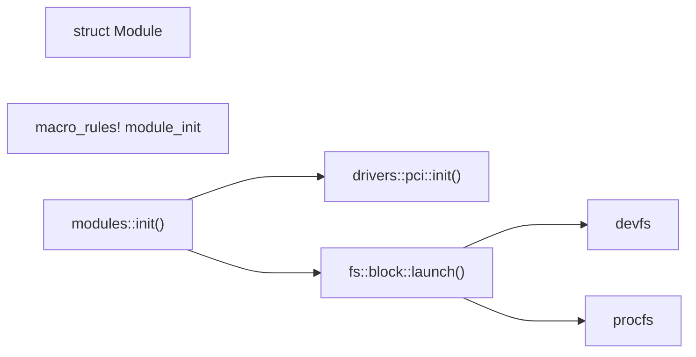

# Aero 代码分析 - bhy

[TOC]

## 阅读范围

在项目的 `/src/aero_kernel/src` 下：

- `modules.rs`

- 由此扩展到 `/fs/devfs.rs` 和 `/fs/block/`

- 也会粗略涉及 `/drivers/`

## 结论

`modules.rs` 中描述的不是动态加载模块，而是“按一定顺序初始化设备和文件系统”这件事。

由这个文件延伸出去，发现`aero` 还是做了一些比较新的事情：

- `devfs` `procfs` 分别对应 `/dev/` 和 `/proc/`两个目录

- `GPT` 分区管理块设备

- 更多块设备支持：`AHCI` `IDE` `DRM`

- 更好的内核终端 `tty` `pty`，包含颜色设定、光标定位、修改、部分清屏、历史输入等

## 主要讲解的部分



## "模块"的定义和使用 `struct Module`

```rust
#[derive(Debug, PartialEq, PartialOrd, Eq, Ord)]
#[repr(C)]
pub enum ModuleType {
    Block = 0,
    Other = 1,
}

#[derive(Debug)]
#[repr(C)]
pub struct Module {
    pub init: *const fn() -> (),
    pub ty: ModuleType,
}
```

只有一个函数指针和一个枚举类型。另有一个全局函数 `pub(crate) fn init()` ，内部会调用所有 `Module` 的 `init`。

即：对"模块"的所有操作仅有调用一个初始化函数

#### 以 ps2键盘设备为例

在 `/src/drivers/keyboards.rs` 中，用一行

```rust
crate::module_init!(ps2_keyboard_init, ModuleType::Other);
```

表示(未来)需要初始化设备。

在 `ps2_keyboard_init` 函数中，包含如下几个部分：

- 通过 `out dx, al` 和 `in al, dx` 指令，向设备发送一系列信号进行交互
  
  - 具体通过 `fn outb(port: u16, value: u8)` 和 `fn inb(port: u16) -> u8`

- 通过 APIC 设置中断信息

- 将键盘设备放入 `devfs`（即 `/dev/`目录下）

其中，IO 过程、中断的设置、devfs 都是在内核里本来就有的，所以这不叫“动态加载”，只是“设备初始化”。

## 如何用宏来登记并实现设备的初始化

上面提到的

```rust
crate::module_init!(ps2_keyboard_init, ModuleType::Other);
```

没有执行其中的函数，而是登记一下，等到 `modules.rs` 中的 `init()` 再一并初始化的。这个过程全程是静态的。

 `modules.rs` 要如何知道哪些地方调用了 `module_init`？

```rust
#[macro_export]
macro_rules! module_init {
    ($init_function:expr, $ty:path) => {
        use crate::modules::ModuleType;

        #[used]
        #[link_section = ".kernel_modules.init"]
        static __MODULE_INIT: $crate::modules::Module = $crate::modules::Module {
            init: $init_function as *const fn() -> (),
            ty: $ty,
        };
    };
}
```

这里把所有模块的初始化函数塞到了同一个段里，然后在 `kernel.ld` 中有

```
.kernel_modules : {
        __kernel_modules_start = .;
        KEEP(*(.kernel_modules.init))
        __kernel_modules_end = .;
    }
```

这样再在 `init()` 函数里调用

```rust
pub(crate) fn init() {
    extern "C" {
        static mut __kernel_modules_start: u8;
        static mut __kernel_modules_end: u8;
    }
```

就获取了所有需要初始化的设备。

#### comments

这个过程很类似 `rCore-Tutorial` `ch3` 时初始化用户程序的流程，但这样在宏里面塞

```rust
#[link_section = "..."]
```

可以用于内核模块，似乎比用 `build.rs` 等方式手动生成要漂亮一些。

## 实际初始化函数 `modules::init()`

如上获取所有的"模块"(即设备)之后，`init()` 中实质上**按顺序**做了这样一些事情

1. 对所有块设备，调用如上填入的初始化函数

2. 初始化 pci 和文件系统

主要是两行

```rust
drivers::pci::init(&mut offset_table);
fs::block::launch().unwrap();
```

3. 对所有其他设备，调用如上填入的初始化函数

## pci 的初始化 `drivers::pci::init()`

枚举 `bus, device, function` 参数查找设备，找到后加入 PCI_TABLE。搜索次数大约是 `8k-64k`循环。

传入的 `offset_table: &mut OffsetPageTable` 没有使用(在内部对应的三个实现中都没有用到)。

#### comments

这里查找 pci 设备的过程或许可以用设备树之类的方式？

在 `init()` 和 `drivers::pci::init(&mut offset_table)` 中有冗余的排序、循环和变量，都是可以改进的

## 文件系统初始化 `fs::block::launch()`

前面提到，`init()`中先要初始化所有块设备，再初始化文件系统。

在块设备的初始化函数中，都会调用

```rust
pub fn install_block_device(dev: Arc<BlockDevice>) -> Result<()>
```

这个函数会将设备名写入目录`/dev/`作为文件，同时把设备存到一个全局的 BtreeMap 中：

```rust
static BLOCK_DEVS: Mutex<BTreeMap<usize, Arc<BlockDevice>>> = Mutex::new(BTreeMap::new());
```

而 `fs::block::launch()` 会按顺序做如下三件事：

1. 从 `BLOCK_DEVS` 取出所有块设备，**默认所有块设备一定是GPT格式**；检查第一块的 magic number；然后读分区入口块作为分区项列表返回（这里一项是128B，但一块只有512B，所以最多四个分区，但代码里没有检查）；获取分区信息；**将可用的分区也作为块设备初始化**
   
   - 如果块设备是 `ext2`，则用它初始化`ROOT_FS`和`ROOT_DIR`

2. 初始化 `devfs`，**管理目录 `/dev/`**， 插入四个虚拟设备：
   
   - `/dev/null` 空设备
   
   - `/dev/kmsg` 管理内核 log，和 `sys_syslog`相关，比 `/proc/kmsg`强一些，可以seek
   
   - `/dev/fb` 帧缓冲设备，读写所有像素的颜色，用于绘图
   
   - `/dev/urandom` 随机数
   
   此外，目录下其他的 `/dev/*` 为实际的块设备和其他设备(键盘等)

3. 初始化 `procfs`，**管理目录 `/proc/`**
   
   - `/proc/cmdline`内核启动的命令行
   
   - `/proc/cpuinfo` 有关 cpu 的各种信息
   
   此外，目录下还有一些初始化时不调用，但启动后会使用的路径
   
   - `/proc/[pid]` 包含一个进程相关的信息。此处 `procfs` 的 `allocate_inode`实际上是在给一个原子变量+1，然后将其作为文件名，本质上它也就是pid

#### comments

GPT格式、分区处理是我之前没怎么见过的

`/dev/` 和 `/proc/` 的管理也是目前缺失的一部分。这里其实在 `busybox` 测例里会涉及一部分，如`dmesg`命令，但只要求不报错就行，不检查是否正确。因此操作系统比赛作品对这两块都实现得比较弱。这其实也是合理的，因为`/dev/`和`/proc/` 细究起来比 `aero` 这里写的还要复杂很多，比赛时并不确定是否还有后续其他的程序需要用到其中的特性，也就缺省实现了。

## 涉及的设备

#### 块设备

- `AHCI`：允许软件和 SATA 存储设备沟通的硬件机制，本质是一种 PCI 设备

- `IDE`：一种硬盘驱动器，也是 PCI 设备

- `DRM`：数字版权管理，约等于带加密解密的块设备(应该是DOOM要)

- `NVME`：硬盘

#### 其他设备

- `ps2_keyboard`：键盘

- `lai`：是 AML 的解释器，AML是 BIOS 和 UEFI 固件的组成部分

- `pty`：虚拟终端设备

- `tty`：终端设备
